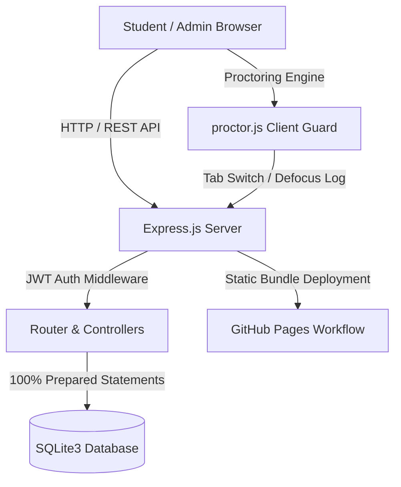

# 🛡️ Online Examination & Anti-Cheating Proctoring Platform

A modern, high-performance, and secure **Online Examination Platform** built with **Node.js (Express), SQLite3, and Tailwind CSS**. Includes an anti-cheating proctoring engine with browser tab/window switching detection, camera preview, fullscreen locking, input restriction guards, real-time warning counters, and auto-submission on violation limits.


---

## 📐 System Architecture



---

## ✨ Key Features & Highlights

### 🛡️ Anti-Cheating & Proctoring Engine
- **Tab Switching Detection**: Uses HTML5 `visibilitychange` API to log when a student leaves or minimizes the browser tab.
- **Window Defocus Tracking**: Uses `window.onblur` to track Alt+Tab, screen splitting, or clicking on external applications.
- **Permission-Prompt Protection & Grace Period**: Ignores focus loss during browser permission dialogs (e.g., camera access prompts) and grants a 5-second grace period upon starting the exam.
- **2.5s Event Debouncer**: Prevents rapid multi-event triggers (e.g. exiting fullscreen triggering both `fullscreenchange` and `blur`) from registering duplicate strikes.
- **Shortcut & Input Guard**: Blocks right-click context menu, text selection, and keyboard shortcuts (`Ctrl+C`, `Ctrl+V`, `Ctrl+X`, `F12`).
- **Auto-Submission**: Automatically terminates and submits the test if the student breaches the maximum violation limit (e.g. 3 warnings).
- **Live Camera Feed**: Optional video preview (`getUserMedia`) displayed on the exam container.

### 🎨 Modern Responsive GUI & Experience
- **Tailwind CSS + FontAwesome 6**: Responsive glassmorphism interface with dark/light mode toggle.
- **Interactive Question Palette**: Color-coded question grid (Answered [Green], Marked for Review [Yellow], Current [Blue], Unanswered [Gray]).
- **Scorecards & Certificates**: Printable exam performance certificate with detailed question-by-question review.

### ⚙️ Admin Management Console
- **Dashboard Analytics**: Real-time stats for total exams, registered students, tab-switching violations, and auto-terminations.
- **Exam & Question Builder**: Create proctored tests, customize violation limits, negative marking, and question options.
- **Real-Time Proctoring Audit Logs**: Audit table detailing student name, violation event, timestamp, and IP address.

---

## 🔑 Pre-Configured Demo Credentials

Run `npm run seed` to automatically seed demo data:

| Role | Email | Password | Access Level |
| :--- | :--- | :--- | :--- |
| **Administrator** | `admin@exam.com` | `admin123` | Full access to Exam Builder, Question Editor & Live Violation Audit Console |
| **Student 1** | `student@exam.com` | `student123` | Enrolled in demo exams with full student capabilities |
| **Student 2** | `pawan@exam.com` | `pawan123` | Student access for testing |

---

## 🔌 API Endpoints Summary

### Authentication (`/api/auth`)
- `POST /api/auth/login`: Authenticate user & issue JWT token.
- `POST /api/auth/register`: Create new user account.
- `GET /api/auth/me`: Get current authenticated user profile.
- `POST /api/auth/update-profile`: Update user profile & avatar.
- `POST /api/auth/logout`: Clear authentication session.

### Examination (`/api/exams`)
- `GET /api/exams`: Fetch available and enrolled examinations.
- `POST /api/exams/enroll/:id`: Enroll student in an exam.
- `GET /api/exams/start/:code`: Initialize exam session and load questions.
- `POST /api/exams/answer`: Save option choice or mark-for-review state.
- `POST /api/exams/submit`: Final submission & automatic score calculation.
- `GET /api/exams/result/:exam_id`: Fetch detailed student result scorecard.

### Admin & Proctoring (`/api/proctor` & `/api/exams/admin`)
- `POST /api/proctor/violation`: Record tab-switch / window defocus violation.
- `GET /api/proctor/admin/logs`: Fetch live proctoring audit trail.
- `GET /api/proctor/admin/stats`: Fetch system analytics metrics.
- `POST /api/exams/admin/create`: Create new proctored exam.
- `POST /api/exams/admin/add-question`: Add question & options to exam.

---

## 🚀 Quickstart (Local Development)

No XAMPP or external database required! The project uses an embedded SQLite database.

```bash
# 1. Install dependencies
npm install

# 2. Seed database with demo data & exams
npm run seed

# 3. Start local server
npm start

# Access application at: http://localhost:3000
```

---

## 🌐 Deploying to GitHub Pages

This repository includes a pre-configured **GitHub Actions Workflow** ([`.github/workflows/deploy-pages.yml`](.github/workflows/deploy-pages.yml)) for automated deployment of static assets to GitHub Pages.

### Step-by-Step GitHub Pages Setup:

1. **Push Code to GitHub**:
   ```bash
   git add .
   git commit -m "Update online examination platform & workflows"
   git push origin main
   ```

2. **Enable GitHub Pages in Repository Settings**:
   - Go to your repository on GitHub.
   - Click on **Settings** -> **Pages** (under Code and automation).
   - Under **Build and deployment** -> **Source**, select **GitHub Actions**.

3. **Automated CI/CD Deployment**:
   - The GitHub Action will automatically trigger on push to `main` / `master`.
   - Once completed, your web interface will be live at:
     `https://<your-username>.github.io/<repository-name>/`

---

## 📂 Project Structure

```
├── .github/
│   └── workflows/
│       └── deploy-pages.yml    # GitHub Actions workflow for GitHub Pages
├── .gitignore                  # Git ignore rules
├── database.js                 # SQLite connection & 100% prepared SQL statements
├── database.sqlite             # Embedded SQLite database file
├── middleware/
│   └── auth.js                 # JWT & Admin authorization middleware
├── public/
│   ├── index.html              # Main single-page application template
│   ├── js/
│   │   ├── app.js              # Client UI router & interactive component script
│   │   └── proctor.js          # Anti-cheating proctoring engine
│   └── uploads/                # Profile photo storage
├── routes/
│   ├── authRoutes.js           # Login, register, profile routes
│   ├── examRoutes.js           # Exam CRUD, testing, grading routes
│   └── proctorRoutes.js        # Violation logging & admin audit routes
├── package.json                # Dependencies & npm scripts
├── README.md                   # Complete documentation
├── seed.js                     # Pre-populates demo exams & users
└── server.js                   # Express server entry point
```

---

## 📄 License

This project is licensed under the [MIT License](LICENSE).
